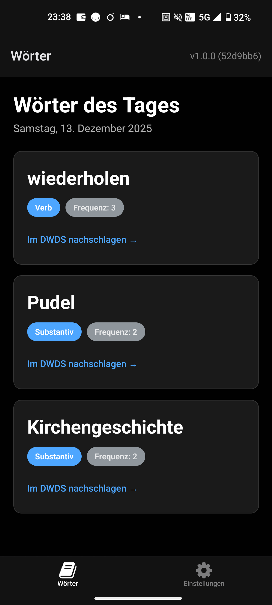
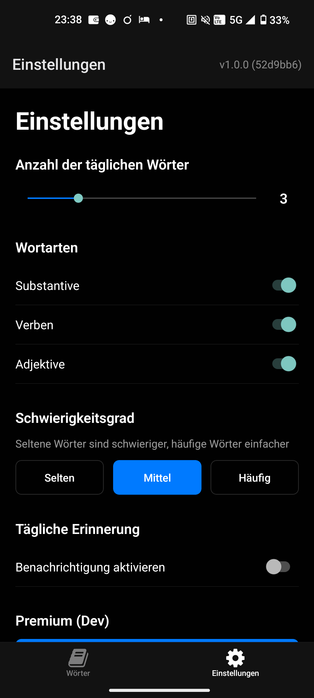
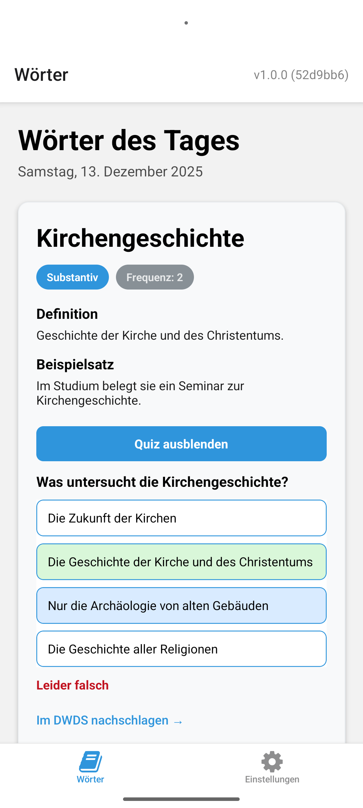
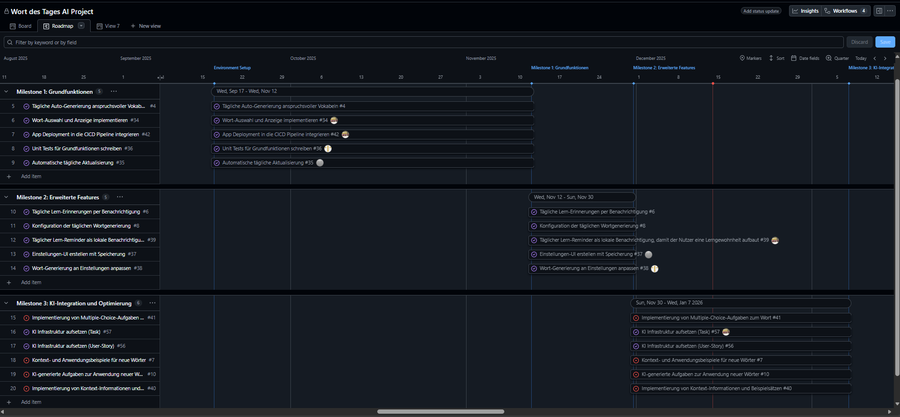

# Realisierungskonzept

## 1. Ziele der Applikation

### Zielgruppe

Ambitionierte Personen mit guten Sprachkenntnissen, die ihren deutschen Wortschatz erweitern wollen, um ihre Sprachfertigkeiten auf das nächste Level zu bringen.

### Hauptziele

| Ziel               | Beschreibung                                                                          |
| ------------------ | ------------------------------------------------------------------------------------- |
| Tägliches Lernen   | Die App generiert jeden Tag mehrere nützliche Wörter, die sich der Nutzer merken kann |
| Erinnerung         | Die App erinnert den Nutzer täglich an das Lernen (Benachrichtigungen)                |
| Kontextverständnis | Die App zeigt, wie und in welchem Kontext die Wörter verwendet werden                 |

### Funktionale Anforderungen

- Tägliche Generierung neuer Wörter
- Einstellbare Menge und Art der Wörter
- Benachrichtigungsfunktion
- KI-gestützte Aufgaben zur korrekten Wortanwendung (Premium)

---

## 2. Komponenten und Verbindungen

### Komponentenübersicht

```
┌─────────────────────────────────────────────────────────────┐
│                        APP (Expo)                           │
├─────────────────────────────────────────────────────────────┤
│  ┌─────────────┐  ┌─────────────┐  ┌─────────────────────┐  │
│  │ HomeScreen  │  │  Settings   │  │    WordCard         │  │
│  │  (index)    │  │   Screen    │  │   (Komponente)      │  │
│  └──────┬──────┘  └──────┬──────┘  └──────────┬──────────┘  │
│         │                │                     │            │
│         ▼                ▼                     ▼            │
│  ┌─────────────────────────────────────────────────────────┐│
│  │                   SERVICES LAYER                        ││
│  │  ┌────────────┐ ┌────────────┐ ┌────────────────────┐   ││
│  │  │wordService │ │settingsServ│ │  premiumService    │   ││
│  │  └─────┬──────┘ └─────┬──────┘ └─────────┬──────────┘   ││
│  │        │              │                  │              ││
│  │  ┌─────▼──────┐ ┌─────▼──────┐    ┌──────▼─────────┐    ││
│  │  │  database  │ │AsyncStorage│    │   aiService    │    ││
│  │  │  (SQLite)  │ │  (Cache)   │    │                │    ││
│  │  └────────────┘ └────────────┘    └────────────────┘    ││
│  └─────────────────────────────────────────────────────────┘│
└─────────────────────────────────────────────────────────────┘
                              │
                              ▼
┌─────────────────────────────────────────────────────────────┐
│                  EDGE FUNCTIONS (Supabase)                  │
├─────────────────────────────────────────────────────────────┤
│  ┌─────────────────┐                                        │
│  │  ai-enrich      │                                        │
│  │  Edge Function  │                                        │
│  └────────┬────────┘                                        │
│           │                                                 │
│           ▼                                                 │
│  ┌─────────────────┐                                        │
│  │   OpenAI API    │                                        │
│  │    (gpt-5)      │                                        │
│  └─────────────────┘                                        │
│                                                             │
│  ┌─────────────────────────────────────────────────────┐    │
│  │ Optional (für Play Store, ausserhalb Schulprojekt)  │    │
│  │  ┌─────────────────┐  ┌─────────────┐               │    │
│  │  │check-entitlement│  │grant-premium│               │    │
│  │  │  Edge Function  │  │Edge Function│               │    │
│  │  └────────┬────────┘  └──────┬──────┘               │    │
│  │           └──────┬───────────┘                      │    │
│  │                  ▼                                  │    │
│  │  ┌──────────────────────────────────┐               │    │
│  │  │    PostgreSQL (entitlements)     │               │    │
│  │  └──────────────────────────────────┘               │    │
│  └─────────────────────────────────────────────────────┘    │
└─────────────────────────────────────────────────────────────┘
```

### Komponentenbeschreibung

| Komponente      | Typ           | Verantwortung                                                 |
| --------------- | ------------- | ------------------------------------------------------------- |
| HomeScreen      | Screen        | Zeigt tägliche Wörter, Pull-to-Refresh, AI-Enrichment         |
| SettingsScreen  | Screen        | Benutzereinstellungen (Wortanzahl, Typen, Benachrichtigungen) |
| WordCard        | UI-Komponente | Einzelne Wortkarte mit Definition und Beispielsatz            |
| wordService     | Service       | Wort-Generierung und -Speicherung                             |
| settingsService | Service       | Laden/Speichern von Einstellungen                             |
| premiumService  | Service       | Premium-Status prüfen und cachen                              |
| aiService       | Service       | KI-Anreicherung mit Caching und Retry-Logik                   |
| database        | Service       | SQLite-Singleton für lokale Wortdatenbank                     |

---

## 3. Architektur

### Architekturübersicht

Die App folgt einer **3-Schichten-Architektur**:

```
┌────────────────────────────────────────────┐
│           PRÄSENTATIONSSCHICHT             │
│  (React Native Komponenten & Screens)      │
└────────────────────┬───────────────────────┘
                     │
┌────────────────────▼───────────────────────┐
│            GESCHÄFTSLOGIK                  │
│  (Services: word, settings, premium, ai)   │
└────────────────────┬───────────────────────┘
                     │
┌────────────────────▼───────────────────────┐
│             DATENSCHICHT                   │
│  (SQLite, AsyncStorage, Supabase)          │
└────────────────────────────────────────────┘
```

### Architekturentscheidungen

| Entscheidung                 | Begründung                                                             |
| ---------------------------- | ---------------------------------------------------------------------- |
| Lokale SQLite-Datenbank      | Offline-Fähigkeit, schnelle Abfragen, keine Serverkosten für Wortdaten |
| Supabase Edge Functions      | Serverless, skalierbar, einfache Deployment                            |
| AsyncStorage für Caching     | Persistenter Cache für Settings, Premium-Status, AI-Responses          |
| Device-basierte Entitlements | Keine Benutzerregistrierung nötig, einfache UX                         |

---

## 4. Technologiestack

### Frontend (Mobile App)

| Technologie  | Version | Zweck                             |
| ------------ | ------- | --------------------------------- |
| React Native | 0.81    | Cross-Platform Mobile Framework   |
| Expo SDK     | 54      | Development Tooling & Native APIs |
| Expo Router  | 6       | File-based Navigation             |
| TypeScript   | 5.9     | Type Safety                       |
| expo-sqlite  | 16      | Lokale Datenbank                  |
| AsyncStorage | 2.2     | Key-Value Storage                 |

### Backend (Supabase Edge Functions)

| Technologie              | Zweck                         |
| ------------------------ | ----------------------------- |
| Supabase Edge Functions  | Serverless API (Deno Runtime) |
| OpenAI API (gpt-4o-mini) | KI-Wortanreicherung           |
| PostgreSQL\*             | Entitlements-Datenbank        |

_\* Vorbereitet für Play Store Release (ausserhalb Schulprojekt)_

### Development & CI/CD

| Tool              | Zweck                        |
| ----------------- | ---------------------------- |
| ESLint + Prettier | Code-Qualität & Formatierung |
| Jest              | Unit Testing                 |
| Husky             | Pre-commit Hooks             |
| GitHub Actions    | CI/CD Pipeline               |
| EAS Build         | Cloud-basierte APK Builds    |

---

## 5. Build-Prozess

### Lokale Entwicklung

```bash
npm install        # Abhängigkeiten installieren
npm start          # Expo Dev Server starten
```

### APK Build (Production)

Der Build-Prozess ist vollständig automatisiert:

1. **Tag erstellen**: `git tag v1.0.0`
2. **Tag pushen**: `git push --tags`
3. **GitHub Actions** triggert EAS Build
4. **APK** wird automatisch auf GitHub Releases hochgeladen

Siehe [DEPLOYMENT.md](DEPLOYMENT.md) für Details.

---

## 6. Externe Abhängigkeiten

### Runtime-Abhängigkeiten

| Abhängigkeit | Zweck                | Kritikalität                      |
| ------------ | -------------------- | --------------------------------- |
| Expo         | App-Framework        | Hoch                              |
| Supabase     | Backend-Services     | Mittel (App funktioniert offline) |
| OpenAI       | KI-Features          | Niedrig (nur Premium)             |
| DWDS         | Wortdatenbank-Quelle | Einmalig (bereits gebündelt)      |

### Externe Services

| Service            | Anbieter              | Fallback                    |
| ------------------ | --------------------- | --------------------------- |
| AI Enrichment      | OpenAI (via Supabase) | Wörter ohne AI-Erklärung    |
| Premium Check      | Supabase              | Gecachter Status            |
| Push Notifications | Expo                  | Keine (Feature deaktiviert) |

---

## 7. Datenmodell und Datenfluss

### Entity-Relationship-Diagramm (ERD)

```
┌─────────────────────┐       ┌─────────────────────────┐
│       wort          │       │     wort_des_tages      │
├─────────────────────┤       ├─────────────────────────┤
│ id (PK)             │◄──────│ fk_wort1 (FK)           │
│ lemma               │◄──────│ fk_wort2 (FK)           │
│ url                 │◄──────│ fk_wort3 (FK)           │
│ wortklasse          │◄──────│ fk_wort4 (FK)           │
│ artikeldatum        │◄──────│ fk_wort5 (FK)           │
│ artikeltyp          │       │ date                    │
│ frequenzklasse      │       └─────────────────────────┘
└─────────────────────┘

┌─────────────────────┐
│   entitlements      │  (Supabase PostgreSQL)
├─────────────────────┤
│ device_id (PK)      │
│ is_premium          │
│ premium_source      │
│ purchase_token      │
└─────────────────────┘
```

### Datenfluss

```
┌──────────┐    ┌──────────┐    ┌──────────┐    ┌──────────┐
│  Start   │───▶│ DB Init  │──▶│  Wörter  │──▶│ Premium  │
│   App    │    │ (SQLite) │    │ Laden    │    │  Check   │
└──────────┘    └──────────┘    └──────────┘    └────┬─────┘
                                                     │
                     ┌───────────────────────────────┘
                     ▼
              ┌─────────────┐    ┌──────────┐    ┌──────────┐
              │ AI Enrich?  │───▶│ Supabase │──▶│  OpenAI  │
              │ (Premium)   │    │   Edge   │    │   API    │
              └─────────────┘    └──────────┘    └──────────┘
```

### DSGVO-Konformität

| Aspekt                 | Umsetzung                                                 |
| ---------------------- | --------------------------------------------------------- |
| Personenbezogene Daten | Nur Device-ID (anonymisiert, kein Bezug zur Person)       |
| Datenminimierung       | Keine unnötigen Daten werden erhoben                      |
| Speicherort            | Supabase (EU-Region möglich)                              |
| Löschung               | Device-ID kann jederzeit aus Entitlements entfernt werden |

### ISDS (Informationssicherheit)

| Massnahme             | Beschreibung                                   |
| --------------------- | ---------------------------------------------- |
| Keine sensiblen Daten | App speichert keine persönlichen Informationen |
| API-Keys serverseitig | OpenAI-Key nur in Supabase Edge Functions      |
| HTTPS                 | Alle Kommunikation verschlüsselt               |

---

## 8. Authentifizierung und Autorisierung

### Authentifizierung

Die App verwendet **keine klassische Benutzerauthentifizierung**:

| Mechanismus | Beschreibung                                          |
| ----------- | ----------------------------------------------------- |
| Kein Login  | Benutzer müssen kein Konto erstellen                  |
| Anonymität  | Keine E-Mail, kein Passwort, keine persönlichen Daten |

### Autorisierung (Premium-System)

> **Hinweis:** Das Premium-System ist vorbereitet für einen späteren Play Store Release. Die Authentifizierung und Kaufvalidierung würde über die Play Store APIs erfolgen. Im Rahmen des Schulprojekts wird Premium nur über einen Dev-Button aktiviert.

**Geplanter Flow (für Play Store):**

```
┌─────────────┐     ┌─────────────┐     ┌─────────────┐
│   App       │────▶│  Supabase   │────▶│ entitlements│
│ (Device-ID) │     │  Function   │     │   Tabelle   │
└─────────────┘     └─────────────┘     └─────────────┘
                           │
                           ▼
                    ┌─────────────┐
                    │ is_premium? │
                    │  true/false │
                    └─────────────┘
```

| Rolle        | Berechtigung                                       |
| ------------ | -------------------------------------------------- |
| Free User    | Tägliche Wörter, Einstellungen, Benachrichtigungen |
| Premium User | + KI-Definitionen, + Beispielsätze                 |

**Aktuell (Schulprojekt):** Premium wird über einen Dev-Button in den Einstellungen aktiviert.

---

## 9. Datenverschlüsselung

### Verschlüsselung während der Übertragung

| Verbindung        | Verschlüsselung |
| ----------------- | --------------- |
| App ↔ Supabase    | HTTPS/TLS 1.3   |
| Supabase ↔ OpenAI | HTTPS/TLS 1.3   |

### Verschlüsselung in Ruhe

| Speicherort         | Verschlüsselung                  |
| ------------------- | -------------------------------- |
| Lokale SQLite-DB    | Geräteverschlüsselung (OS-Level) |
| AsyncStorage        | Geräteverschlüsselung (OS-Level) |
| Supabase PostgreSQL | AES-256 (Supabase-managed)       |

### Sensible Daten

| Datentyp             | Speicherort      | Schutz             |
| -------------------- | ---------------- | ------------------ |
| OpenAI API Key       | Supabase Secrets | Nie im Client-Code |
| Supabase Service Key | Supabase Secrets | Nur serverseitig   |
| Device-ID            | App + Supabase   | Pseudonymisiert    |

---

## 10. Sicherheitsrichtlinien

### Proaktive Sicherheitsmassnahmen

| Massnahme           | Umsetzung                                   |
| ------------------- | ------------------------------------------- |
| Input Validation    | Alle Supabase Functions validieren Eingaben |
| Rate Limiting       | Supabase integriertes Rate Limiting         |
| Keine SQL-Injection | Parametrisierte Queries in SQLite           |
| Dependency Scanning | Dependabot für automatische Updates         |

### Schwachstellenmanagement

| Prozess         | Beschreibung                                                            |
| --------------- | ----------------------------------------------------------------------- |
| Dependabot      | Automatische PRs für Sicherheitsupdates                                 |
| CodeQL          | Statische Code-Analyse auf Sicherheitslücken (SQL Injection, XSS, etc.) |
| Secret Scanning | Erkennt versehentlich committete API-Keys und Secrets                   |
| npm audit       | Regelmässige Prüfung auf bekannte Schwachstellen                        |
| Code Review     | Alle Änderungen über Pull Requests                                      |
| AI Code Review  | Automatische PR Reviews durch Github Copilot & Codex Review             |

### Notfallplanung

| Szenario               | Massnahme                                                            |
| ---------------------- | -------------------------------------------------------------------- |
| API-Key kompromittiert | Key in Supabase Dashboard rotieren                                   |
| Supabase-Ausfall       | App funktioniert offline mit gecachten Daten                         |
| Datenverlust           | Wortdatenbank ist in App gebündelt, Entitlements in Supabase Backups |

---

## 11. Interface-Design

### Prototypen

**HomeScreen:**



**SettingsScreen:**



**HomeScreen mit Premium (Light Mode):**



---

## 12. Layout, Farben und Typografie

### Farbschema

| Element            | Light Mode | Dark Mode |
| ------------------ | ---------- | --------- |
| Hintergrund        | `#FFFFFF`  | `#000000` |
| Text               | `#000000`  | `#FFFFFF` |
| Primärfarbe        | `#2f95dc`  | `#4da6ff` |
| Akzent (Buttons)   | `#007AFF`  | `#007AFF` |
| Karten-Hintergrund | `#f8f9fa`  | `#1a1a1a` |
| Karten-Rand        | `#e9ecef`  | `#333333` |

### Typografie

| Element      | Schriftart    | Grösse |
| ------------ | ------------- | ------ |
| Titel        | System (Bold) | 32px   |
| Wort (Lemma) | System (Bold) | 24px   |
| Untertitel   | System        | 16px   |
| Body Text    | System        | 14px   |
| Monospace    | SpaceMono     | 14px   |

### Layout-Prinzipien

| Prinzip                 | Wert |
| ----------------------- | ---- |
| Standard Padding        | 20px |
| Card Margin             | 16px |
| Border Radius (Cards)   | 12px |
| Border Radius (Buttons) | 8px  |

---

## 13. Projektorganisation und Ressourcen

### Team

| Name    | Fokus                | Aufgaben                             |
| ------- | -------------------- | ------------------------------------ |
| Gabriel | Entwicklung & DevOps | Code, CI/CD, Infrastruktur           |
| Ayan    | Projektmanagement    | Planung, Koordination, Dokumentation |
| Raphael | Qualitätsmanagement  | Testing, Code Review, QA             |

> Alle Teammitglieder arbeiten auch bereichsübergreifend.

### Ressourcen

| Ressource            | Beschreibung                   |
| -------------------- | ------------------------------ |
| GitHub Repository    | Versionskontrolle, Issues, PRs |
| Supabase (Free Tier) | Backend-Services               |
| Expo/EAS (Free Tier) | Build-Service                  |
| OpenAI API           | Pay-as-you-go für KI-Features  |

---

## 14. Zeitplan und Meilensteine

### Projektstart

**27. August 2025** - Erster Commit

### Meilensteine

| Meilenstein         | Fällig     | Status           | Beschreibung                                                                                 |
| ------------------- | ---------- | ---------------- | -------------------------------------------------------------------------------------------- |
| Environment Setup   | 17.09.2025 | ✅ Abgeschlossen | Infrastruktur-Setup (CI/CD, Linting, Testing)                                                |
| Grundfunktionen     | 12.11.2025 | ✅ Abgeschlossen | MVP mit Kernfunktionen: App-Struktur, tägliche Wort-Generierung, UI, Datenspeicherung        |
| Erweiterte Features | 30.11.2025 | ✅ Abgeschlossen | Benachrichtigungen, Benutzereinstellungen, konfigurierbare Wortoptionen                      |
| KI-Integration      | 07.01.2026 | 🔄 In Arbeit     | KI-Features für erweiterte Lernfunktionen, kontextuelle Erklärungen, Performance-Optimierung |
| Zusatz/Sonstiges    | -          | 📋 Offen         | Zusätzliche Features und Verbesserungen                                                      |



https://github.com/users/Gabko14/projects/11/views/4

### Feature-Timeline

| Datum     | Feature                                        |
| --------- | ---------------------------------------------- |
| Aug 2025  | Projektstart                                   |
| Sept 2025 | Projekt-Setup, Ziele definiert, CI/CD Pipeline |
| Sept 2025 | Wort-Anzeige mit SQLite-Datenbank              |
| Okt 2025  | Einstellungen UI mit AsyncStorage              |
| Okt 2025  | Benachrichtigungen                             |
| Nov 2025  | KI-Infrastruktur (Supabase, Premium)           |
| Dez 2025  | KI-Anreicherung mit Caching                    |

---

## 15. Risiken

### Identifizierte Risiken

| Risiko                    | Wahrscheinlichkeit | Auswirkung | Massnahme                             |
| ------------------------- | ------------------ | ---------- | ------------------------------------- |
| Supabase Free Tier Limits | Mittel             | Mittel     | Monitoring, Upgrade-Plan              |
| OpenAI API Kosten         | Niedrig            | Niedrig    | Rate Limiting, Caching                |
| Expo SDK Breaking Changes | Mittel             | Hoch       | Versionen fixieren, testen vor Update |
| Teamausfall               | Niedrig            | Hoch       | Dokumentation, Code Reviews           |

### Technologische Herausforderungen

| Herausforderung           | Lösung                                  |
| ------------------------- | --------------------------------------- |
| Offline-Fähigkeit         | Lokale SQLite-DB, AsyncStorage Caching  |
| Cross-Platform Konsistenz | Expo abstrahiert Plattform-Unterschiede |
| KI-Response Qualität      | Prompt Engineering, Feedback-Loop       |

---

## 16. Wartungsplan

### Regelmässige Wartung

| Aktivität             | Frequenz                   | Verantwortlich |
| --------------------- | -------------------------- | -------------- |
| Dependency Updates    | Monatlich (Dependabot)     | Gabriel        |
| Sicherheitsupdates    | Sofort bei kritischen CVEs | Gabriel        |
| Expo SDK Updates      | Bei Major Releases         | Gabriel        |
| Datenbank-Erweiterung | Bei Bedarf                 | Team           |

### Nach Go-Live

| Aktivität        | Beschreibung                     |
| ---------------- | -------------------------------- |
| Bug Monitoring   | GitHub Issues überwachen         |
| Performance      | Bei Beschwerden analysieren      |
| Feature Requests | Im Backlog sammeln, priorisieren |

---

## 17. Supportstruktur

### Support-Modell

Da es sich um ein **Schulprojekt** handelt, gibt es keinen formellen Support.

| Kanal         | Beschreibung                     |
| ------------- | -------------------------------- |
| GitHub Issues | Bug Reports und Feature Requests |
| README        | Installationsanleitung und FAQ   |

### SLA

Kein SLA definiert - Best-Effort Support durch das Team.

---

## 18. Release-Planung

### Versionierung

Wir nutzen **Semantic Versioning** (SemVer): `MAJOR.MINOR.PATCH`

| Teil  | Wann erhöhen?    | Beispiel |
| ----- | ---------------- | -------- |
| MAJOR | Breaking Changes | 2.0.0    |
| MINOR | Neue Features    | 1.1.0    |
| PATCH | Bugfixes         | 1.0.1    |

### Release-Prozess

1. Feature-Entwicklung auf Feature-Branch
2. Pull Request erstellen
3. Code Review + CI muss grün sein
4. Merge in `main`
5. Tag erstellen (`v1.x.x`)
6. Automatischer Build + Release

Siehe [DEPLOYMENT.md](DEPLOYMENT.md) für Details.

### Geplante Releases

| Version | Features                                       | Status     |
| ------- | ---------------------------------------------- | ---------- |
| 1.0.0   | MVP: Wörter, Einstellungen, Benachrichtigungen | ✅ Fertig  |
| 1.1.0   | Premium + KI-Anreicherung                      | ✅ Fertig  |
| 1.2.0   | Quiz-Feature (geplant)                         | 🔜 Backlog |
